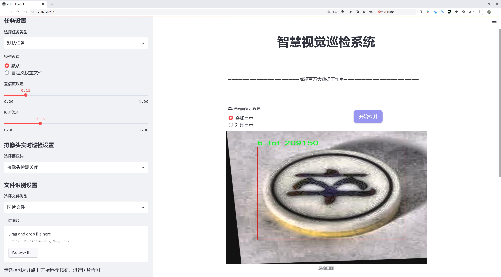
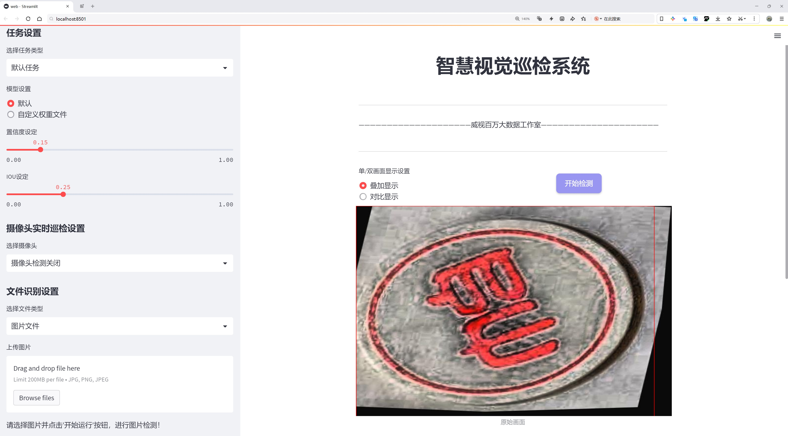
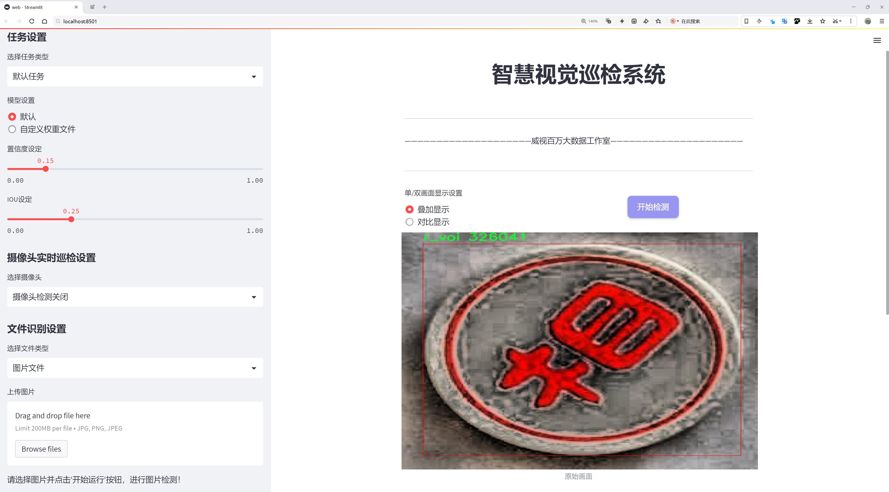
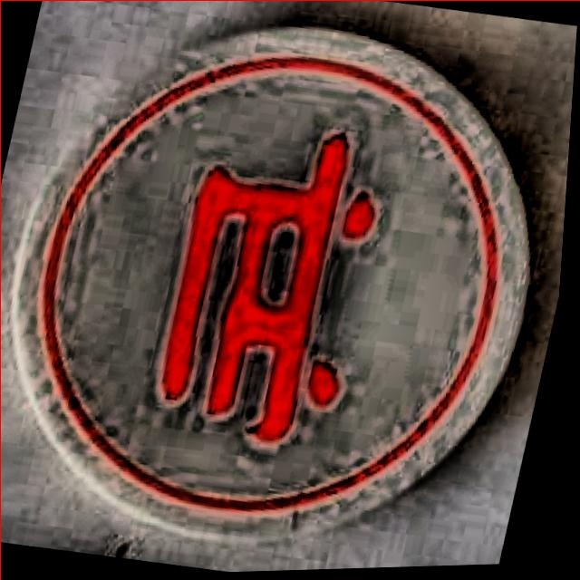
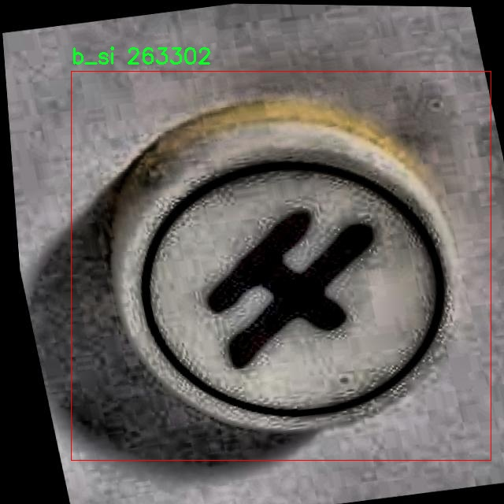
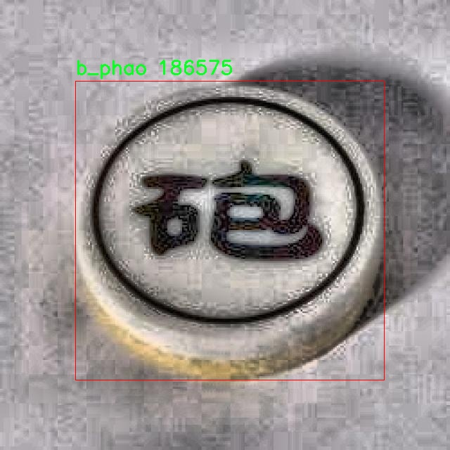
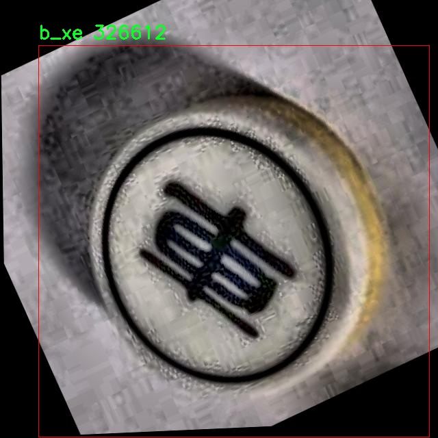

# 中国象棋棋子检测系统源码分享
 # [一条龙教学YOLOV8标注好的数据集一键训练_70+全套改进创新点发刊_Web前端展示]

### 1.研究背景与意义

项目参考[AAAI Association for the Advancement of Artificial Intelligence](https://gitee.com/qunmasj/projects)

项目来源[AACV Association for the Advancement of Computer Vision](https://kdocs.cn/l/cszuIiCKVNis)

研究背景与意义

中国象棋作为一种历史悠久的传统棋类游戏，不仅在中国广泛流行，也在东亚及其他地区拥有众多爱好者。随着信息技术的迅猛发展，尤其是计算机视觉和人工智能技术的不断进步，利用这些技术对中国象棋棋局进行自动化分析和识别，已成为研究的热点之一。传统的棋局分析往往依赖于人工观察和记录，效率低下且容易出现误差。基于计算机视觉的棋子检测系统，能够有效提高棋局分析的准确性和效率，为棋手提供实时的对局分析、策略建议和学习辅助，具有重要的应用价值。

在众多的目标检测算法中，YOLO（You Only Look Once）系列算法因其高效性和实时性受到广泛关注。YOLOv8作为该系列的最新版本，进一步提升了检测精度和速度，适合用于复杂场景下的目标检测任务。然而，现有的YOLOv8模型在特定领域的应用上仍存在一定的局限性，尤其是在中国象棋棋子检测这一细分领域。因此，基于改进YOLOv8的中国象棋棋子检测系统的研究，具有重要的理论意义和实际应用价值。

本研究将利用包含724张图像的中国象棋棋子数据集，涵盖14类棋子，包括黑方和红方的不同棋子，如马、炮、士、将、车等。该数据集的多样性和丰富性为模型的训练提供了良好的基础。通过对YOLOv8模型进行改进，结合数据集的特征，旨在提升模型对中国象棋棋子的检测精度和鲁棒性。具体而言，研究将探索如何通过数据增强、特征提取和模型优化等手段，提升模型在不同光照、角度和背景下的检测能力。

此外，本研究的意义还体现在推动象棋文化的传播与发展。随着智能手机和互联网的普及，越来越多的年轻人开始接触和学习中国象棋。通过开发高效的棋子检测系统，可以为在线象棋平台提供更智能的功能，如自动识别棋局、实时分析对局和智能推荐策略等。这不仅能够提升用户体验，还能吸引更多年轻人参与到中国象棋的学习和对弈中，从而促进传统文化的传承与发展。

综上所述，基于改进YOLOv8的中国象棋棋子检测系统的研究，不仅具有重要的学术价值，也为实际应用提供了有力支持。通过该研究，期望能够为中国象棋的智能化发展提供新的思路和方法，同时为计算机视觉领域的目标检测技术提供借鉴与参考。

### 2.图片演示







##### 注意：由于此博客编辑较早，上面“2.图片演示”和“3.视频演示”展示的系统图片或者视频可能为老版本，新版本在老版本的基础上升级如下：（实际效果以升级的新版本为准）

  （1）适配了YOLOV8的“目标检测”模型和“实例分割”模型，通过加载相应的权重（.pt）文件即可自适应加载模型。

  （2）支持“图片识别”、“视频识别”、“摄像头实时识别”三种识别模式。

  （3）支持“图片识别”、“视频识别”、“摄像头实时识别”三种识别结果保存导出，解决手动导出（容易卡顿出现爆内存）存在的问题，识别完自动保存结果并导出到tempDir中。

  （4）支持Web前端系统中的标题、背景图等自定义修改，后面提供修改教程。

  另外本项目提供训练的数据集和训练教程,暂不提供权重文件（best.pt）,需要您按照教程进行训练后实现图片演示和Web前端界面演示的效果。

### 3.视频演示

[3.1 视频演示](https://www.bilibili.com/video/BV1Ei2MY5EgS/)

### 4.数据集信息展示

##### 4.1 本项目数据集详细数据（类别数＆类别名）

nc: 14
names: ['b_ma', 'b_phao', 'b_si', 'b_tot', 'b_tuong', 'b_voi', 'b_xe', 'r_binh', 'r_ma', 'r_phao', 'r_si', 'r_tuong', 'r_voi', 'r_xe']


##### 4.2 本项目数据集信息介绍

数据集信息展示

在构建改进YOLOv8的中国象棋棋子检测系统的过程中，数据集的选择与构建至关重要。本项目所使用的数据集名为“Chinese_Chess”，其设计旨在为棋子检测提供丰富而多样的样本，以提高模型的准确性和鲁棒性。该数据集包含14个类别，涵盖了中国象棋中所有主要棋子的种类。这些类别包括：黑方的马（b_ma）、炮（b_phao）、士（b_si）、卒（b_tot）、将（b_tuong）、象（b_voi）、车（b_xe），以及红方的兵（r_binh）、马（r_ma）、炮（r_phao）、士（r_si）、将（r_tuong）、象（r_voi）、车（r_xe）。这些棋子不仅在形状和颜色上存在显著差异，而且在棋局中的功能和位置也各具特色，这为模型的训练提供了多样化的挑战。

数据集的构建过程中，充分考虑了不同棋子在实际对局中的表现和外观特征。每种棋子都经过精心挑选和标注，确保其在不同光照、角度和背景下的可识别性。为了增强模型的泛化能力，数据集中包含了大量的图像样本，这些样本来源于真实的棋局拍摄以及合成图像。通过这种方式，数据集不仅能够反映出棋子的真实外观，还能模拟出不同的对局场景，使得模型在训练过程中能够学习到更多的特征。

在数据标注方面，采用了严格的标注标准，以确保每个棋子都被准确地框定和分类。每张图像都经过多次审核，确保标注的准确性和一致性。此外，为了应对可能出现的图像噪声和干扰，数据集中还包含了一些具有挑战性的样本，例如棋子部分遮挡、模糊或低光照条件下的图像。这些样本的引入，旨在提升模型在复杂环境下的检测能力，使其能够在实际应用中表现出色。

在数据集的规模上，"Chinese_Chess"数据集包含了数千张高质量的图像，涵盖了每个类别的多种变体。这种丰富的样本量不仅为模型提供了足够的训练数据，还为后续的验证和测试提供了可靠的基础。通过对数据集的精心设计与构建，模型能够在训练过程中有效地学习到每个棋子的特征，从而提高检测的准确性和效率。

综上所述，"Chinese_Chess"数据集为改进YOLOv8的中国象棋棋子检测系统提供了坚实的基础。通过对数据集的多样性、标注准确性和样本量的精心设计，项目团队期望能够构建出一个高效、准确的棋子检测模型，进而推动中国象棋智能化的发展。该数据集不仅是模型训练的核心资源，更是实现智能棋局分析与自动化对局的重要支撑。随着技术的不断进步，未来有望在更广泛的应用场景中实现中国象棋的智能化与自动化。










### 5.全套项目环境部署视频教程（零基础手把手教学）

[5.1 环境部署教程链接（零基础手把手教学）](https://www.ixigua.com/7404473917358506534?logTag=c807d0cbc21c0ef59de5)


[5.2 安装Python虚拟环境创建和依赖库安装视频教程链接（零基础手把手教学）](https://www.ixigua.com/7404474678003106304?logTag=1f1041108cd1f708b01a)

### 6.手把手YOLOV8训练视频教程（零基础小白有手就能学会）

[6.1 手把手YOLOV8训练视频教程（零基础小白有手就能学会）](https://www.ixigua.com/7404477157818401292?logTag=d31a2dfd1983c9668658)


按照上面的训练视频教程链接加载项目提供的数据集，运行train.py即可开始训练



     Epoch   gpu_mem       box       obj       cls    labels  img_size
     1/200     20.8G   0.01576   0.01955  0.007536        22      1280: 100%|██████████| 849/849 [14:42<00:00,  1.04s/it]
               Class     Images     Labels          P          R     mAP@.5 mAP@.5:.95: 100%|██████████| 213/213 [01:14<00:00,  2.87it/s]
                 all       3395      17314      0.994      0.957      0.0957      0.0843

     Epoch   gpu_mem       box       obj       cls    labels  img_size
     2/200     20.8G   0.01578   0.01923  0.007006        22      1280: 100%|██████████| 849/849 [14:44<00:00,  1.04s/it]
               Class     Images     Labels          P          R     mAP@.5 mAP@.5:.95: 100%|██████████| 213/213 [01:12<00:00,  2.95it/s]
                 all       3395      17314      0.996      0.956      0.0957      0.0845

     Epoch   gpu_mem       box       obj       cls    labels  img_size
     3/200     20.8G   0.01561    0.0191  0.006895        27      1280: 100%|██████████| 849/849 [10:56<00:00,  1.29it/s]
               Class     Images     Labels          P          R     mAP@.5 mAP@.5:.95: 100%|███████   | 187/213 [00:52<00:00,  4.04it/s]
                 all       3395      17314      0.996      0.957      0.0957      0.0845


### 7.70+种全套YOLOV8创新点代码加载调参视频教程（一键加载写好的改进模型的配置文件）

[7.1 70+种全套YOLOV8创新点代码加载调参视频教程（一键加载写好的改进模型的配置文件）](https://www.ixigua.com/7404478314661806627?logTag=29066f8288e3f4eea3a4)

### 8.70+种全套YOLOV8创新点原理讲解（非科班也可以轻松写刊发刊，V10版本正在科研待更新）

#### 由于篇幅限制，每个创新点的具体原理讲解就不一一展开，具体见下列网址中的创新点对应子项目的技术原理博客网址【Blog】：


[8.1 70+种全套YOLOV8创新点原理讲解链接](https://gitee.com/qunmasj/good)

#### 部分改进原理讲解(完整的改进原理见上图和技术博客链接)【如果此小节的图加载失败可以通过CSDN或者Github搜索该博客的标题访问原始博客，原始博客图片显示正常】
### YOLOv8简介
#### Yolov8网络模型
Yolov8n的网络分为输入端、主干网( Back-bone) 、Neck模块和输出端4个部分（图4)。输
人端主要有马赛克( Mosaic）数据增强、自适应锚框计算和自适应灰度填充。主干网有Conv、C2和SPPF结构，其中，C2r模块是对残差特征进行学习的主要模块，该模块仿照Yolov7的ELAN结构,通过更多的分支跨层连接，丰富了模型的梯度流，可形成一个具有更强特征表示能力的神经网络模
块。Neck模块采用PAN ( path aggregation nelwOrk ,结构，可加强网络对不同缩放尺度对象特征融合的
能力。输出端将分类和检测过程进行解耦，主要包括损失计算和目标检测框筛选，其中，损失计算过程主要包括正负样本分配策略和 Loss计算，Yolov8n 网络主要使用TaskAlignedAssignerl 10]方法，即根据分类与回归的分数加权结果选择正样本;Loss计算包括分类和回归2个分支，无Ob-jecIness分支。分类分支依然采用BCE Loss，回归分支则使用了Distribution Focal Loss!11〕和CIOU( complele inlersection over union)损失函数。

### 可扩张残差（DWR）注意力模块
当前的许多工作直接采用多速率深度扩张卷积从一个输入特征图中同时捕获多尺度上下文信息，从而提高实时语义分割的特征提取效率。 然而，这种设计可能会因为结构和超参数的不合理而导致多尺度上下文信息的访问困难。 为了降低绘制多尺度上下文信息的难度，我们提出了一种高效的多尺度特征提取方法，该方法分解了原始的单步特征提取方法方法分为两个步骤，区域残差-语义残差。 在该方法中，多速率深度扩张卷积在特征提取中发挥更简单的作用：根据第一步提供的每个简明区域形式特征图，在第二步中使用一个所需的感受野执行简单的基于语义的形态过滤 一步，提高他们的效率。 此外，扩张率和扩张卷积的容量每个网络阶段都经过精心设计，以充分利用所有可以实现的区域形式的特征图。 因此，我们分别为高层和低层网络设计了一种新颖的扩张式残差（DWR）模块和简单倒置残差（SIR）模块。


首先，该博客引入了一个Dilation-wise Residual（DWR）模块，用于提取网络高层的特征，如图2a所示。多分支结构用于扩展感受野，其中每个分支采用不同空洞率的空洞深度卷积。
然后，专门设计了一个Simple Inverted Residual（SIR）模块来提取网络低层的特征，如图2b所示。该模块仅具有3×3的微小感受野，但使用inverted bottleneck式结构来扩展通道数量，确保更强的特征提取能力。
最后，基于DWR和SIR模块，构建了一个编码器-解码器风格的网络DWRSeg，其中解码器采用了简单的类似FCN的结构。解码器使用来自最后两个阶段的强语义信息直接对特征图进行上采样，然后将它们与来自较低阶段的特征图（包含丰富的详细信息）拼接起来，以进行最终预测。


### 9.系统功能展示（检测对象为举例，实际内容以本项目数据集为准）

图9.1.系统支持检测结果表格显示

  图9.2.系统支持置信度和IOU阈值手动调节

  图9.3.系统支持自定义加载权重文件best.pt(需要你通过步骤5中训练获得)

  图9.4.系统支持摄像头实时识别

  图9.5.系统支持图片识别

  图9.6.系统支持视频识别

  图9.7.系统支持识别结果文件自动保存

  图9.8.系统支持Excel导出检测结果数据


### 10.原始YOLOV8算法原理

原始YOLOv8算法原理

YOLOv8算法是目标检测领域中的一项重要进展，旨在提高检测精度和推理速度，同时保持模型的轻量化特性。该算法的设计理念是基于YOLO系列的成功经验，结合了最新的深度学习技术和架构改进，形成了一种更为高效的目标检测模型。YOLOv8不仅在模型结构上进行了创新，还在训练策略和损失函数的设计上做出了显著改进。

YOLOv8的网络结构主要分为三个部分：Backbone、Neck和Head。Backbone部分负责特征提取，采用了一系列卷积和反卷积层，通过残差连接和瓶颈结构来优化网络性能和减少参数量。具体而言，YOLOv8使用了C2模块作为基本构成单元，结合了5个CBS模块、4个C2f模块和1个快速空间金字塔池化(SPPF)模块。这种设计不仅提高了特征提取的效率，还保证了网络在不同层次上能够捕捉到丰富的特征信息。

在Neck部分，YOLOv8采用了多尺度特征融合技术，将来自Backbone不同阶段的特征图进行融合，以更好地捕捉不同尺度目标的信息。这一过程对于提升目标检测的性能和鲁棒性至关重要，因为现实场景中的目标往往具有不同的尺寸和形状。通过有效地整合多层次的特征，YOLOv8能够在各种复杂环境中保持较高的检测精度。

Head部分则负责最终的目标检测和分类任务。YOLOv8引入了三种检测头，分别用于处理不同尺寸的信息。这些检测头由一系列卷积层和反卷积层构成，旨在生成高质量的检测结果。与传统的Anchor-Based方法不同，YOLOv8采用了Anchor-Free的策略，直接预测目标的中心位置，并使用任务对齐学习(TAL)来优化样本分配。这种创新的解耦合头结构使得分类和定位任务可以并行进行，从而提高了模型的收敛速度和预测精度。

YOLOv8在训练过程中也引入了一些新的策略，以增强模型的泛化能力。例如，在训练的最后10个epoch中，YOLOv8停止使用马赛克数据增强，避免了数据增强对真实分布的破坏。此外，YOLOv8在损失计算方面采用了BCELoss作为分类损失，DFLLoss和CIoULoss作为回归损失。这种多样化的损失函数设计使得模型在处理复杂目标时能够更好地平衡分类和定位的精度。

在网络架构的具体实现上，YOLOv8对C3模块进行了替换，采用了C2f模块。C2f模块的设计灵感来源于YOLOv7中的ELAN模块，增加了更多的残差连接，从而提升了梯度流的信息传递能力。这样的改进不仅保证了模型的轻量化，还使得网络在特征提取时能够更有效地利用信息。此外，YOLOv8还保留了SPPF模块，以保持高效的特征提取性能。

值得注意的是，YOLOv8的多种模型结构（如YOLOv8n、YOLOv8s、YOLOv8m、YOLOv8l和YOLOv8x）为不同应用场景提供了灵活的选择。这些模型在缩放系数、深度和特征图宽度上有所不同，但它们的基本原理和设计理念保持一致。这种灵活性使得YOLOv8能够适应各种实际应用需求，从实时监控到复杂场景的目标检测，均能展现出优异的性能。

总体而言，YOLOv8算法通过对网络结构的优化、训练策略的改进以及损失函数的创新，显著提升了目标检测的效率和准确性。它不仅在理论上提供了新的思路，也在实践中展现了强大的应用潜力。随着YOLOv8的推广和应用，目标检测技术将在更多领域发挥重要作用，为智能视觉系统的发展提供有力支持。


### 11.项目核心源码讲解（再也不用担心看不懂代码逻辑）

#### 11.1 ui.py

以下是对代码的核心部分进行提炼和详细注释的版本：

```python
import sys  # 导入系统模块，用于获取Python解释器的路径
import subprocess  # 导入子进程模块，用于执行外部命令
from QtFusion.path import abs_path  # 从QtFusion.path模块导入abs_path函数，用于获取绝对路径

def run_script(script_path):
    """
    使用当前 Python 环境运行指定的脚本。

    Args:
        script_path (str): 要运行的脚本路径

    Returns:
        None
    """
    # 获取当前 Python 解释器的路径
    python_path = sys.executable

    # 构建运行命令，使用streamlit运行指定的脚本
    command = f'"{python_path}" -m streamlit run "{script_path}"'

    # 执行命令
    result = subprocess.run(command, shell=True)  # 使用shell执行命令
    if result.returncode != 0:  # 检查命令执行是否成功
        print("脚本运行出错。")  # 如果返回码不为0，输出错误信息

# 实例化并运行应用
if __name__ == "__main__":
    # 指定要运行的脚本路径，使用abs_path获取绝对路径
    script_path = abs_path("web.py")

    # 运行指定的脚本
    run_script(script_path)
```

### 代码核心部分分析：
1. **模块导入**：
   - `sys`：用于获取当前Python解释器的路径。
   - `subprocess`：用于执行外部命令，能够运行系统命令并获取其返回状态。
   - `abs_path`：用于将相对路径转换为绝对路径，确保脚本可以在任何工作目录下正确找到。

2. **`run_script`函数**：
   - 接收一个脚本路径作为参数，构建一个命令来运行该脚本。
   - 使用`subprocess.run`来执行命令，并检查返回状态以判断脚本是否成功运行。

3. **主程序块**：
   - 在程序入口处，定义要运行的脚本路径，并调用`run_script`函数来执行该脚本。

通过这些核心部分，代码实现了在当前Python环境中运行指定的Streamlit脚本，并能够处理运行错误。

这个文件名为 `ui.py`，其主要功能是通过当前的 Python 环境来运行一个指定的脚本，具体来说是一个名为 `web.py` 的脚本。文件中首先导入了必要的模块，包括 `sys`、`os` 和 `subprocess`，以及一个自定义的路径处理函数 `abs_path`，该函数来自于 `QtFusion.path` 模块。

在 `run_script` 函数中，接受一个参数 `script_path`，这个参数是要运行的脚本的路径。函数内部首先获取当前 Python 解释器的路径，存储在 `python_path` 变量中。接着，构建一个命令字符串，使用 `streamlit` 模块来运行指定的脚本。这里的命令格式为 `"{python_path}" -m streamlit run "{script_path}"`，这意味着使用当前的 Python 解释器执行 `streamlit` 模块，并运行指定的脚本。

然后，使用 `subprocess.run` 方法来执行这个命令，`shell=True` 表示在一个新的 shell 中执行该命令。执行后，检查返回的结果，如果返回码不为 0，表示脚本运行过程中出现了错误，此时会打印出“脚本运行出错。”的提示信息。

在文件的最后部分，使用 `if __name__ == "__main__":` 语句来确保当该文件作为主程序运行时，才会执行以下代码。这里指定了要运行的脚本路径，即通过 `abs_path` 函数获取的 `web.py` 的绝对路径。最后，调用 `run_script` 函数来执行这个脚本。

总体来说，这个程序的核心功能是通过命令行方式运行一个 Streamlit 应用，并提供了错误处理机制以便于调试。

#### 11.2 code\ultralytics\utils\callbacks\raytune.py

以下是代码中最核心的部分，并附上详细的中文注释：

```python
# 导入Ultralytics YOLO所需的设置
from ultralytics.utils import SETTINGS

# 尝试导入Ray和Ray Tune库，并验证Ray Tune集成是否启用
try:
    assert SETTINGS["raytune"] is True  # 验证Ray Tune集成是否启用
    import ray
    from ray import tune
    from ray.air import session
except (ImportError, AssertionError):
    tune = None  # 如果导入失败或集成未启用，则将tune设置为None

# 定义在每个训练周期结束时调用的回调函数
def on_fit_epoch_end(trainer):
    """在每个训练周期结束时将训练指标发送到Ray Tune。"""
    if ray.tune.is_session_enabled():  # 检查Ray Tune会话是否启用
        metrics = trainer.metrics  # 获取当前训练指标
        metrics["epoch"] = trainer.epoch  # 将当前周期数添加到指标中
        session.report(metrics)  # 将指标报告给Ray Tune

# 定义回调函数集合，如果tune可用，则包含on_fit_epoch_end函数
callbacks = (
    {
        "on_fit_epoch_end": on_fit_epoch_end,  # 训练周期结束时的回调
    }
    if tune  # 如果tune可用
    else {}
)
```

### 代码解析：
1. **导入设置**：首先从`ultralytics.utils`模块导入`SETTINGS`，以获取配置。
2. **尝试导入Ray库**：使用`try`语句导入Ray及其相关模块，并检查`SETTINGS`中是否启用了Ray Tune集成。
3. **定义回调函数**：`on_fit_epoch_end`函数在每个训练周期结束时被调用，用于将训练指标发送到Ray Tune。
4. **报告指标**：如果Ray Tune会话已启用，则从训练器中获取当前的训练指标，并将当前周期数添加到指标中，最后通过`session.report`方法将这些指标报告给Ray Tune。
5. **回调集合**：根据`tune`是否可用，定义一个包含回调函数的字典，确保在训练过程中可以调用相应的回调。

这个程序文件是用于与Ray Tune集成的回调函数，主要用于在训练过程中将训练指标发送到Ray Tune。文件的开头部分引入了必要的模块和设置，首先从`ultralytics.utils`中导入了`SETTINGS`。接着，程序尝试检查`SETTINGS`中是否启用了Ray Tune集成，即`SETTINGS["raytune"]`是否为`True`。如果启用，则导入Ray及其相关模块`tune`和`session`。如果未启用或导入失败，则将`tune`设置为`None`。

接下来的函数`on_fit_epoch_end(trainer)`是在每个训练周期结束时调用的回调函数。它的作用是将当前的训练指标发送到Ray Tune。函数内部首先检查Ray Tune的会话是否已启用，如果启用，则获取当前训练器的指标，并将当前的训练周期（epoch）添加到指标中。最后，通过`session.report(metrics)`将这些指标报告给Ray Tune。

在文件的最后部分，定义了一个`callbacks`字典，如果`tune`模块被成功导入并且启用，则包含`on_fit_epoch_end`回调函数；如果未启用，则返回一个空字典。这种设计使得在使用Ray Tune时，可以方便地将训练过程中的指标传递给Ray Tune进行监控和调优。

#### 11.3 code\ultralytics\models\nas\predict.py

以下是代码中最核心的部分，并附上详细的中文注释：

```python
import torch
from ultralytics.engine.predictor import BasePredictor
from ultralytics.engine.results import Results
from ultralytics.utils import ops

class NASPredictor(BasePredictor):
    """
    Ultralytics YOLO NAS 预测器，用于目标检测。

    该类扩展了 Ultralytics 引擎中的 `BasePredictor`，负责对 YOLO NAS 模型生成的原始预测结果进行后处理。
    它应用了非极大值抑制（NMS）和将边界框缩放到原始图像尺寸等操作。

    属性:
        args (Namespace): 包含各种后处理配置的命名空间。
    """

    def postprocess(self, preds_in, img, orig_imgs):
        """对预测结果进行后处理，并返回 Results 对象的列表。"""

        # 将预测框从 xyxy 格式转换为 xywh 格式，并获取类别分数
        boxes = ops.xyxy2xywh(preds_in[0][0])  # preds_in[0][0] 是边界框的坐标
        preds = torch.cat((boxes, preds_in[0][1]), -1).permute(0, 2, 1)  # 合并边界框和类别分数，并调整维度

        # 应用非极大值抑制（NMS）来过滤冗余的预测框
        preds = ops.non_max_suppression(
            preds,
            self.args.conf,  # 置信度阈值
            self.args.iou,   # IOU 阈值
            agnostic=self.args.agnostic_nms,  # 是否对类别进行无关处理
            max_det=self.args.max_det,  # 最大检测数量
            classes=self.args.classes,   # 指定的类别
        )

        # 如果输入的原始图像不是列表，则将其转换为 numpy 数组
        if not isinstance(orig_imgs, list):  
            orig_imgs = ops.convert_torch2numpy_batch(orig_imgs)

        results = []  # 初始化结果列表
        for i, pred in enumerate(preds):  # 遍历每个预测结果
            orig_img = orig_imgs[i]  # 获取对应的原始图像
            # 将预测框缩放到原始图像的尺寸
            pred[:, :4] = ops.scale_boxes(img.shape[2:], pred[:, :4], orig_img.shape)
            img_path = self.batch[0][i]  # 获取图像路径
            # 将结果添加到结果列表中
            results.append(Results(orig_img, path=img_path, names=self.model.names, boxes=pred))
        return results  # 返回处理后的结果列表
```

### 代码核心部分说明：
1. **导入必要的库**：引入 PyTorch 和 Ultralytics 的相关模块。
2. **NASPredictor 类**：继承自 `BasePredictor`，负责处理 YOLO NAS 模型的预测结果。
3. **postprocess 方法**：核心的后处理函数，执行以下步骤：
   - 将预测框格式转换为适合后续处理的格式。
   - 应用非极大值抑制（NMS）来减少冗余的预测框。
   - 将预测框缩放到原始图像的尺寸。
   - 将处理后的结果存储在 `Results` 对象中并返回。

该程序文件是Ultralytics YOLO NAS模型的预测模块，主要用于目标检测。它继承自Ultralytics引擎中的`BasePredictor`类，负责对YOLO NAS模型生成的原始预测结果进行后处理。后处理的主要操作包括非极大值抑制（NMS）和将边界框缩放到原始图像的尺寸。

在类的文档字符串中，说明了该类的功能和用法示例。通常，这个类不会被直接实例化，而是在`NAS`类内部使用。

在`postprocess`方法中，首先将输入的预测结果进行处理，提取出边界框和类别分数。使用`ops.xyxy2xywh`函数将边界框从(x1, y1, x2, y2)格式转换为(x_center, y_center, width, height)格式。接着，通过`torch.cat`将边界框和类别分数合并，并进行维度调整。

然后，调用`ops.non_max_suppression`函数对合并后的预测结果进行非极大值抑制，以去除冗余的边界框。此时，NMS的参数如置信度阈值、IOU阈值、是否进行类别无关的NMS、最大检测数量和指定的类别等都是从类的属性`args`中获取的。

接下来，程序检查输入的原始图像是否为列表格式。如果不是，则将其转换为NumPy数组格式。接着，程序遍历每个预测结果，并根据原始图像的尺寸调整边界框的大小，确保它们与原始图像相匹配。最后，将处理后的结果存储在`Results`对象中，并返回这些结果。

总的来说，该文件的主要功能是将YOLO NAS模型的原始预测结果进行后处理，以便于后续的分析和展示。

#### 11.4 code\ultralytics\utils\__init__.py

以下是代码中最核心的部分，并附上详细的中文注释：

```python
import os
import platform
import logging
from pathlib import Path
import torch
import yaml

# 定义一些常量
ROOT = Path(__file__).resolve().parents[1]  # 获取项目根目录
DEFAULT_CFG_PATH = ROOT / "cfg/default.yaml"  # 默认配置文件路径

# 设置 PyTorch 打印选项
torch.set_printoptions(linewidth=320, precision=4, profile="default")

# 设置日志记录
def set_logging(name="ultralytics", verbose=True):
    """设置日志记录，支持 UTF-8 编码。"""
    level = logging.INFO if verbose else logging.ERROR  # 根据是否详细输出设置日志级别
    logging.basicConfig(level=level, format='%(message)s')  # 配置日志格式
    logger = logging.getLogger(name)  # 获取日志记录器
    return logger

# 设置全局日志记录器
LOGGER = set_logging()  # 定义全局日志记录器

# YAML 文件的保存和加载函数
def yaml_save(file="data.yaml", data=None):
    """将数据保存为 YAML 格式的文件。"""
    if data is None:
        data = {}
    file = Path(file)
    if not file.parent.exists():
        file.parent.mkdir(parents=True, exist_ok=True)  # 创建父目录
    with open(file, "w", encoding="utf-8") as f:
        yaml.safe_dump(data, f, sort_keys=False, allow_unicode=True)  # 将数据写入 YAML 文件

def yaml_load(file="data.yaml"):
    """从 YAML 文件加载数据。"""
    with open(file, encoding="utf-8") as f:
        return yaml.safe_load(f) or {}  # 返回加载的数据，确保返回字典类型

# 默认配置加载
DEFAULT_CFG_DICT = yaml_load(DEFAULT_CFG_PATH)  # 从默认配置文件加载配置
DEFAULT_CFG = SimpleNamespace(**DEFAULT_CFG_DICT)  # 将配置转换为命名空间对象

# 检查当前操作系统
def is_ubuntu() -> bool:
    """检查当前操作系统是否为 Ubuntu。"""
    return platform.system() == "Linux" and Path("/etc/os-release").exists()

# 运行时环境检测
ENVIRONMENT = (
    "Colab" if "COLAB_RELEASE_TAG" in os.environ else
    "Kaggle" if os.environ.get("PWD") == "/kaggle/working" else
    platform.system()  # 其他操作系统
)

# 其他初始化设置
USER_CONFIG_DIR = Path(os.getenv("YOLO_CONFIG_DIR") or Path.home() / ".config" / "Ultralytics")  # 用户配置目录
USER_CONFIG_DIR.mkdir(parents=True, exist_ok=True)  # 创建用户配置目录

# 设置 Sentry 用于错误跟踪
def set_sentry():
    """初始化 Sentry SDK 进行错误跟踪和报告。"""
    try:
        import sentry_sdk  # 尝试导入 Sentry SDK
        sentry_sdk.init(dsn="your_sentry_dsn_here")  # 初始化 Sentry
    except ImportError:
        LOGGER.warning("Sentry SDK 未安装，无法进行错误跟踪。")  # 如果未安装 Sentry SDK，输出警告

set_sentry()  # 调用 Sentry 初始化函数
```

### 代码说明：
1. **常量定义**：定义了项目根目录和默认配置文件路径。
2. **日志记录设置**：通过 `set_logging` 函数设置日志记录器，支持 UTF-8 编码。
3. **YAML 文件处理**：提供了 `yaml_save` 和 `yaml_load` 函数，用于保存和加载 YAML 格式的数据。
4. **默认配置加载**：从默认配置文件加载配置，并将其转换为命名空间对象，方便后续使用。
5. **操作系统检测**：提供了 `is_ubuntu` 函数来检查当前操作系统是否为 Ubuntu。
6. **运行时环境检测**：通过环境变量判断当前运行环境（如 Colab、Kaggle 等）。
7. **用户配置目录**：获取用户配置目录并确保其存在。
8. **Sentry 初始化**：提供了 `set_sentry` 函数用于初始化 Sentry SDK 进行错误跟踪。

这些部分是代码的核心功能，确保了项目的基本配置和运行环境的检测。

这个程序文件是Ultralytics YOLO（You Only Look Once）库的一个初始化模块，主要用于设置和管理库的各种功能和配置。文件的开头部分引入了多个Python标准库和第三方库，诸如`os`、`logging`、`torch`等，这些库为后续的功能提供了支持。

文件中定义了一些常量和全局变量，包括当前文件路径、根目录、默认配置路径、线程数等。通过环境变量，程序可以判断是否启用自动安装和详细输出模式。这些常量和变量在后续的功能实现中会被广泛使用。

接下来，文件定义了一些类和函数。`TQDM`类是对`tqdm`库的封装，提供了一个自定义的进度条显示方式。`SimpleClass`和`IterableSimpleNamespace`类则是为了简化对象的字符串表示和属性访问，便于调试和使用。

文件还定义了一些用于处理YAML文件的函数，包括`yaml_save`和`yaml_load`，这些函数可以将数据保存为YAML格式，或从YAML文件中加载数据。此外，还有`yaml_print`函数用于以美观的格式打印YAML数据。

在文件的后半部分，定义了一系列用于检查运行环境的函数，例如`is_ubuntu`、`is_colab`、`is_kaggle`等，这些函数可以帮助程序判断当前的操作系统或运行环境，以便进行相应的配置或优化。

此外，文件中还实现了多线程安全的装饰器`ThreadingLocked`，以及用于设置日志记录的`set_logging`函数。日志记录功能允许用户在运行程序时查看重要信息和错误消息。

在文件的最后部分，程序执行了一些初始化步骤，包括检查首次安装、设置用户配置目录、应用猴子补丁等。这些步骤确保库在不同环境下的兼容性和功能性。

总的来说，这个初始化模块为Ultralytics YOLO库提供了基础设施，确保库的各项功能能够正常运行，并为用户提供友好的使用体验。

#### 11.5 train.py

以下是经过简化和注释的核心代码部分，主要保留了训练检测模型的功能，并对每个方法进行了详细的中文注释：

```python
import random
import numpy as np
import torch.nn as nn
from ultralytics.data import build_dataloader, build_yolo_dataset
from ultralytics.engine.trainer import BaseTrainer
from ultralytics.models import yolo
from ultralytics.nn.tasks import DetectionModel
from ultralytics.utils import LOGGER, RANK
from ultralytics.utils.torch_utils import de_parallel, torch_distributed_zero_first

class DetectionTrainer(BaseTrainer):
    """
    扩展自 BaseTrainer 类，用于基于检测模型的训练。
    """

    def build_dataset(self, img_path, mode="train", batch=None):
        """
        构建 YOLO 数据集。

        参数:
            img_path (str): 包含图像的文件夹路径。
            mode (str): 模式，可以是 `train` 或 `val`，用户可以为每种模式自定义不同的增强。
            batch (int, optional): 批次大小，适用于 `rect` 模式。默认为 None。
        """
        gs = max(int(de_parallel(self.model).stride.max() if self.model else 0), 32)
        return build_yolo_dataset(self.args, img_path, batch, self.data, mode=mode, rect=mode == "val", stride=gs)

    def get_dataloader(self, dataset_path, batch_size=16, rank=0, mode="train"):
        """构造并返回数据加载器。"""
        assert mode in ["train", "val"]
        with torch_distributed_zero_first(rank):  # 仅在 DDP 中初始化数据集 *.cache 一次
            dataset = self.build_dataset(dataset_path, mode, batch_size)
        shuffle = mode == "train"  # 训练模式下打乱数据
        workers = self.args.workers if mode == "train" else self.args.workers * 2
        return build_dataloader(dataset, batch_size, workers, shuffle, rank)  # 返回数据加载器

    def preprocess_batch(self, batch):
        """对一批图像进行预处理，包括缩放和转换为浮点数。"""
        batch["img"] = batch["img"].to(self.device, non_blocking=True).float() / 255  # 将图像归一化到 [0, 1]
        if self.args.multi_scale:  # 如果启用多尺度训练
            imgs = batch["img"]
            sz = (
                random.randrange(self.args.imgsz * 0.5, self.args.imgsz * 1.5 + self.stride)
                // self.stride
                * self.stride
            )  # 随机选择图像大小
            sf = sz / max(imgs.shape[2:])  # 计算缩放因子
            if sf != 1:
                ns = [
                    math.ceil(x * sf / self.stride) * self.stride for x in imgs.shape[2:]
                ]  # 计算新的形状
                imgs = nn.functional.interpolate(imgs, size=ns, mode="bilinear", align_corners=False)  # 进行插值
            batch["img"] = imgs
        return batch

    def get_model(self, cfg=None, weights=None, verbose=True):
        """返回 YOLO 检测模型。"""
        model = DetectionModel(cfg, nc=self.data["nc"], verbose=verbose and RANK == -1)
        if weights:
            model.load(weights)  # 加载预训练权重
        return model

    def plot_training_samples(self, batch, ni):
        """绘制带有注释的训练样本。"""
        plot_images(
            images=batch["img"],
            batch_idx=batch["batch_idx"],
            cls=batch["cls"].squeeze(-1),
            bboxes=batch["bboxes"],
            paths=batch["im_file"],
            fname=self.save_dir / f"train_batch{ni}.jpg",
            on_plot=self.on_plot,
        )

    def plot_metrics(self):
        """从 CSV 文件中绘制指标。"""
        plot_results(file=self.csv, on_plot=self.on_plot)  # 保存结果图
```

### 代码注释说明：
1. **构建数据集**：`build_dataset` 方法用于根据给定的图像路径和模式构建 YOLO 数据集，支持训练和验证模式。
2. **获取数据加载器**：`get_dataloader` 方法用于构造数据加载器，支持多进程和数据打乱。
3. **预处理批次**：`preprocess_batch` 方法对输入的图像批次进行归一化和缩放处理，以适应模型输入。
4. **获取模型**：`get_model` 方法用于返回一个 YOLO 检测模型，并可选择加载预训练权重。
5. **绘制训练样本**：`plot_training_samples` 方法用于可视化训练样本及其对应的标签。
6. **绘制指标**：`plot_metrics` 方法用于从 CSV 文件中绘制训练过程中的指标。

以上是核心代码部分及其详细注释，便于理解和使用。

这个程序文件 `train.py` 是一个用于训练 YOLO（You Only Look Once）目标检测模型的 Python 脚本，属于 Ultralytics YOLO 框架的一部分。它继承自 `BaseTrainer` 类，专注于构建和训练基于 YOLO 的检测模型。

在文件的开头，导入了一些必要的库和模块，包括数学运算、随机数生成、深度学习相关的库（如 PyTorch）以及 Ultralytics YOLO 框架中的特定模块。这些导入为后续的模型训练和数据处理提供了基础。

`DetectionTrainer` 类中定义了多个方法。`build_dataset` 方法用于构建 YOLO 数据集，接收图像路径、模式（训练或验证）和批量大小作为参数。它使用 `build_yolo_dataset` 函数来生成数据集，并根据模式选择不同的增强策略。

`get_dataloader` 方法负责构建数据加载器，确保在分布式训练时只初始化一次数据集，并根据模式选择是否打乱数据。它还根据模式调整工作线程的数量。

`preprocess_batch` 方法用于对图像批次进行预处理，包括将图像缩放到合适的大小并转换为浮点数格式。该方法还支持多尺度训练，通过随机选择图像大小来增强模型的鲁棒性。

`set_model_attributes` 方法将数据集的类别数量和名称等属性附加到模型上，以便模型能够正确处理训练数据。

`get_model` 方法返回一个 YOLO 检测模型实例，并可以加载预训练权重。`get_validator` 方法返回一个用于模型验证的 `DetectionValidator` 实例，负责计算和记录损失。

`label_loss_items` 方法用于返回带有标签的训练损失项的字典，方便在训练过程中监控模型性能。`progress_string` 方法返回一个格式化的字符串，显示训练进度，包括当前的 epoch、GPU 内存使用情况和损失值。

`plot_training_samples` 方法用于绘制训练样本及其注释，便于可视化训练数据的质量。`plot_metrics` 方法从 CSV 文件中绘制训练过程中的指标，生成结果图像。最后，`plot_training_labels` 方法创建一个带标签的训练图，展示训练数据中的边界框和类别信息。

整体而言，这个文件实现了 YOLO 模型的训练流程，包括数据集构建、数据加载、图像预处理、模型设置、损失计算和结果可视化等关键步骤，为用户提供了一个完整的训练框架。

#### 11.6 70+种YOLOv8算法改进源码大全和调试加载训练教程（非必要）\ultralytics\models\yolo\segment\val.py

以下是经过简化和注释的核心代码部分，主要关注于分割模型的验证过程：

```python
# 导入必要的库
from ultralytics.models.yolo.detect import DetectionValidator
from ultralytics.utils import ops
import torch
import numpy as np

class SegmentationValidator(DetectionValidator):
    """
    扩展DetectionValidator类的分割验证器，用于基于分割模型的验证。
    """

    def __init__(self, dataloader=None, save_dir=None, pbar=None, args=None, _callbacks=None):
        """初始化SegmentationValidator，设置任务为'segment'，并初始化度量指标。"""
        super().__init__(dataloader, save_dir, pbar, args, _callbacks)
        self.plot_masks = []  # 用于存储绘制的掩码
        self.args.task = 'segment'  # 设置任务类型为分割
        self.metrics = SegmentMetrics(save_dir=self.save_dir, on_plot=self.on_plot)  # 初始化度量指标

    def preprocess(self, batch):
        """预处理批次数据，将掩码转换为浮点型并发送到设备。"""
        batch = super().preprocess(batch)  # 调用父类的预处理方法
        batch['masks'] = batch['masks'].to(self.device).float()  # 将掩码转移到设备并转换为浮点型
        return batch

    def postprocess(self, preds):
        """后处理YOLO预测，返回输出检测结果和原型。"""
        # 使用非极大值抑制来过滤预测结果
        p = ops.non_max_suppression(preds[0], self.args.conf, self.args.iou, labels=self.lb,
                                     multi_label=True, agnostic=self.args.single_cls,
                                     max_det=self.args.max_det, nc=self.nc)
        proto = preds[1][-1] if len(preds[1]) == 3 else preds[1]  # 获取原型
        return p, proto

    def update_metrics(self, preds, batch):
        """更新度量指标，计算正确的掩码和边界框。"""
        for si, (pred, proto) in enumerate(zip(preds[0], preds[1])):
            idx = batch['batch_idx'] == si  # 获取当前批次的索引
            cls = batch['cls'][idx]  # 获取当前批次的类别
            bbox = batch['bboxes'][idx]  # 获取当前批次的边界框
            npr = pred.shape[0]  # 预测数量
            shape = batch['ori_shape'][si]  # 原始图像形状
            correct_masks = torch.zeros(npr, self.niou, dtype=torch.bool, device=self.device)  # 初始化正确掩码
            correct_bboxes = torch.zeros(npr, self.niou, dtype=torch.bool, device=self.device)  # 初始化正确边界框
            self.seen += 1  # 增加已处理的样本数量

            if npr == 0:  # 如果没有预测
                if cls.shape[0]:  # 如果有标签
                    self.stats.append((correct_bboxes, correct_masks, *torch.zeros((2, 0), device=self.device), cls.squeeze(-1)))
                continue

            # 处理掩码
            gt_masks = batch['masks'][idx]  # 获取真实掩码
            pred_masks = self.process(proto, pred[:, 6:], pred[:, :4], shape=batch['img'][si].shape[1:])  # 处理预测掩码

            # 评估
            if cls.shape[0]:  # 如果有标签
                correct_bboxes = self._process_batch(pred, labelsn)  # 处理边界框
                correct_masks = self._process_batch(pred, labelsn, pred_masks, gt_masks, masks=True)  # 处理掩码

            # 记录统计信息
            self.stats.append((correct_bboxes, correct_masks, pred[:, 4], pred[:, 5], cls.squeeze(-1)))

    def _process_batch(self, detections, labels, pred_masks=None, gt_masks=None, overlap=False, masks=False):
        """
        返回正确的预测矩阵。

        参数:
            detections (array[N, 6]): 预测结果，包括边界框和置信度
            labels (array[M, 5]): 真实标签，包括类别和边界框

        返回:
            correct (array[N, 10]): 对应于10个IoU水平的正确预测
        """
        if masks:
            # 处理掩码的IoU计算
            iou = mask_iou(gt_masks.view(gt_masks.shape[0], -1), pred_masks.view(pred_masks.shape[0], -1))
        else:
            # 处理边界框的IoU计算
            iou = box_iou(labels[:, 1:], detections[:, :4])

        return self.match_predictions(detections[:, 5], labels[:, 0], iou)  # 匹配预测与标签

    def plot_predictions(self, batch, preds, ni):
        """绘制批次预测结果，包括掩码和边界框。"""
        plot_images(batch['img'], *output_to_target(preds[0], max_det=15),  # 绘制图像
                    torch.cat(self.plot_masks, dim=0) if len(self.plot_masks) else self.plot_masks,
                    paths=batch['im_file'],
                    fname=self.save_dir / f'val_batch{ni}_pred.jpg',
                    names=self.names,
                    on_plot=self.on_plot)  # 绘制预测结果
        self.plot_masks.clear()  # 清空绘制的掩码
```

### 代码说明：
1. **SegmentationValidator类**：该类用于对分割模型进行验证，继承自`DetectionValidator`类。
2. **初始化方法**：设置任务类型为分割，并初始化度量指标。
3. **预处理方法**：将输入批次中的掩码转换为浮点型并发送到设备。
4. **后处理方法**：对YOLO的预测结果进行非极大值抑制，返回处理后的检测结果和原型。
5. **更新度量指标**：根据预测结果和真实标签更新度量指标，包括正确的掩码和边界框。
6. **处理批次**：计算预测结果与真实标签之间的IoU，并返回正确的预测矩阵。
7. **绘制预测结果**：将预测结果（包括掩码和边界框）绘制到图像上。

这个程序文件是一个用于YOLOv8模型的分割验证器的实现，继承自检测验证器（DetectionValidator），主要用于对分割模型的验证和评估。代码的结构清晰，包含了初始化、预处理、后处理、更新指标、绘图等多个功能模块。

在初始化方法中，首先调用父类的构造函数，然后设置任务类型为“segment”，并初始化用于计算分割指标的SegmentMetrics类。接着，在预处理阶段，将输入的mask数据转换为浮点数并发送到指定的设备上（如GPU）。

在初始化指标时，根据是否需要保存JSON格式的结果来选择不同的mask处理函数。若需要保存JSON，则使用更精确的mask上采样方法；否则，使用更快的处理方法。获取描述信息的方法返回格式化的评估指标描述。

后处理方法用于处理YOLO模型的预测结果，应用非极大值抑制（NMS）来过滤预测框，并根据模型的输出返回处理后的结果。更新指标的方法则对每个批次的预测结果进行评估，包括处理mask和边界框的正确性，并更新统计信息。

在绘图方法中，程序会将验证样本和预测结果进行可视化，帮助用户直观地查看模型的表现。最后，pred_to_json方法用于将预测结果保存为JSON格式，便于后续的评估和分析。

整个程序中，使用了多线程来加速mask的编码过程，并且提供了与COCO数据集兼容的评估功能，能够计算mAP等指标。通过这些功能，用户可以方便地对YOLOv8分割模型进行验证和性能评估。

### 12.系统整体结构（节选）

### 整体功能和构架概括

该程序是一个完整的目标检测和分割框架，基于YOLO（You Only Look Once）算法，主要用于训练、验证和推理。框架包含多个模块，分别负责不同的功能，如数据处理、模型训练、预测、回调、评估等。整体架构设计清晰，模块化程度高，便于扩展和维护。

- **数据处理**：负责数据集的构建、加载和预处理。
- **模型训练**：实现了YOLO模型的训练过程，包括损失计算、指标更新和可视化。
- **模型验证**：提供了验证器，评估模型在验证集上的性能，包括计算mAP等指标。
- **推理**：支持对输入图像进行推理，生成检测结果。
- **回调和监控**：集成了Ray Tune等工具，用于模型训练过程中的监控和调优。
- **工具函数**：提供了各种实用工具函数，如文件下载、日志记录等。

### 文件功能整理表

| 文件路径                                                                                      | 功能描述                                                                                         |
|----------------------------------------------------------------------------------------------|--------------------------------------------------------------------------------------------------|
| `C:\shangjia\code\ui.py`                                                                    | 运行指定的Streamlit脚本，提供一个用户界面以便于模型的可视化和交互。                               |
| `code\ultralytics\utils\callbacks\raytune.py`                                              | 与Ray Tune集成的回调函数，用于在训练过程中报告指标，支持超参数调优。                             |
| `code\ultralytics\models\nas\predict.py`                                                   | 对YOLO NAS模型的预测结果进行后处理，包括非极大值抑制和边界框缩放。                              |
| `code\ultralytics\utils\__init__.py`                                                       | Ultralytics YOLO库的初始化模块，设置常量、全局变量和工具函数，提供基础设施支持。                  |
| `train.py`                                                                                   | 训练YOLO模型的主程序，负责数据集构建、数据加载、模型训练和结果可视化。                          |
| `70+种YOLOv8算法改进源码大全和调试加载训练教程（非必要）\ultralytics\models\yolo\segment\val.py` | YOLOv8分割模型的验证器，负责评估模型在分割任务上的性能，计算指标并生成可视化结果。               |
| `code\ultralytics\utils\downloads.py`                                                      | 提供文件下载功能，支持从网络下载模型权重和数据集。                                              |
| `70+种YOLOv8算法改进源码大全和调试加载训练教程（非必要）\ultralytics\nn\extra_modules\afpn.py` | 实现自适应特征金字塔网络（AFPN），用于增强特征提取能力，提升模型性能。                          |
| `code\ultralytics\models\rtdetr\predict.py`                                                | 实现RT-DETR模型的推理功能，处理输入图像并生成检测结果。                                         |
| `code\ultralytics\models\yolo\detect\__init__.py`                                          | YOLO检测模型的初始化模块，设置模型参数和配置。                                                 |
| `70+种YOLOv8算法改进源码大全和调试加载训练教程（非必要）\ultralytics\models\yolo\model.py`    | 定义YOLO模型的结构和前向传播逻辑，包含模型的构建和训练过程。                                     |
| `70+种YOLOv8算法改进源码大全和调试加载训练教程（非必要）\ultralytics\utils\downloads.py`    | 提供文件下载功能，支持从网络下载模型权重和数据集（重复，可能是路径不同）。                      |
| `code\ultralytics\utils\tuner.py`                                                           | 提供超参数调优功能，支持对模型训练过程中的超参数进行优化和调整。                                 |

以上表格总结了各个文件的主要功能，帮助理解整个YOLOv8框架的构成和功能模块。

注意：由于此博客编辑较早，上面“11.项目核心源码讲解（再也不用担心看不懂代码逻辑）”中部分代码可能会优化升级，仅供参考学习，完整“训练源码”、“Web前端界面”和“70+种创新点源码”以“13.完整训练+Web前端界面+70+种创新点源码、数据集获取”的内容为准。

### 13.完整训练+Web前端界面+70+种创新点源码、数据集获取


# [下载链接：https://mbd.pub/o/bread/ZpyYmZdx](https://mbd.pub/o/bread/ZpyYmZdx)